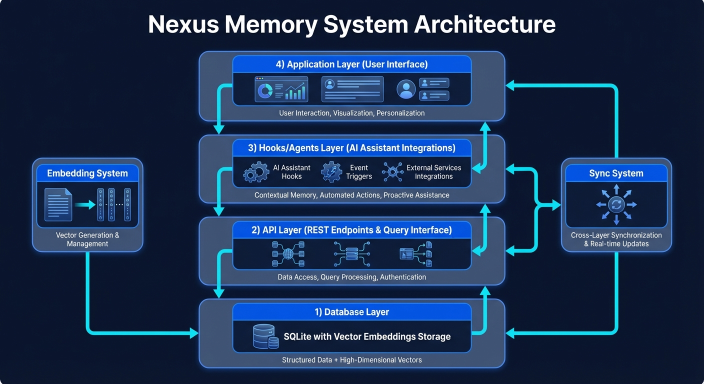
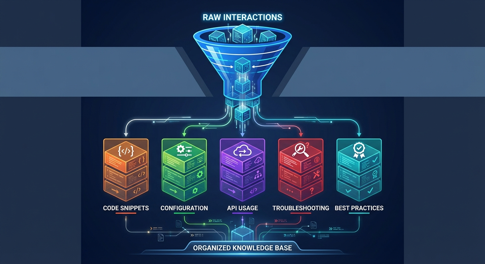

# Nexus Memory System Architecture

Nexus is a memory runtime for coding agents that is designed to feel less like a log collector and more like a bounded subconscious. This document explains how the shipped system works today: how it captures activity, turns it into memory, dreams over it, and brings back the right context when an agent asks a question.



## The System In One View

```text
┌──────────────────────────────────────────────────────────────────────┐
│                         Agent-Facing Surfaces                        │
├──────────────────────────────────────────────────────────────────────┤
│  CLI  │  Hooks  │  Wrappers  │  MCP  │  Web / Dashboard / API      │
└──────────────────────────────────────────────────────────────────────┘
                 \        |          |          /
                  \       |          |         /
                   └──────┴──────────┴────────┘
                                |
                                v
                    ┌────────────────────────┐
                    │   Nexus Cognition      │
                    │ derive • digest •      │
                    │ dream • represent •    │
                    │ query • identity       │
                    └───────────┬────────────┘
                                |
            ┌───────────────────┼───────────────────┐
            v                   v                   v
   ┌────────────────┐  ┌────────────────┐  ┌────────────────────┐
   │ nexus-storage  │  │ nexus-vectors  │  │ nexus-embeddings   │
   │ SQLite + repos │  │ semantic rank  │  │ local + remote     │
   └────────┬───────┘  └────────┬───────┘  └──────────┬─────────┘
            \                   |                     /
             \                  |                    /
              └─────────────────┴───────────────────┘
                                |
                                v
                     ┌─────────────────────┐
                     │ nexus-core + llm    │
                     │ types, config,      │
                     │ provider clients    │
                     └─────────────────────┘
```

## What Nexus Is Optimizing For

Nexus is opinionated about a few things:

- memory should be useful before it is clever
- storage should stay local, inspectable, and operationally sane
- background cognition should be bounded
- agent integrations should be honest about what they actually support
- retrieval should combine semantic ranking with structured memory layers, not rely on a single search trick

That is why the system keeps SQLite as its canonical store, builds cognition in layers, and treats observability as a product feature rather than an afterthought.

## The Core Loop

The shipped cognition loop is:

1. Capture activity from hooks, wrappers, sessions, or explicit writes.
2. Normalize raw events into a stable internal shape.
3. Derive explicit observations from raw or low-signal activity.
4. Build and refresh session digests.
5. Dream in bounded cycles to reinforce patterns, detect contradictions, and produce higher-order insights.
6. Assemble a working representation when the system needs to answer a question or build context.
7. Return answers, lineage, introspection, or operator data through CLI, MCP, or web surfaces.

The important detail is that the system never assumes raw activity is already knowledge. It earns better memory gradually.

## Crate Roles

### `nexus-core`

Shared types, config, category definitions, cognitive metadata, support-tier modeling, and other cross-cutting contracts live here.

This crate defines the language the rest of the system speaks:

- categories such as `general`, `facts`, `preferences`, `context`, `specifications`, and `session`
- cognitive levels such as raw, explicit, derived, digest, and contradiction-oriented memory
- runtime configuration for generation, embeddings, and bounded cognition behavior

### `nexus-storage`

`nexus-storage` owns the canonical SQLite persistence layer.

It manages:

- schema initialization and migrations
- namespace and memory repositories
- cognition job queues
- digest pointers
- evidence lineage
- relation storage
- processed file tracking
- retrieval queries and bounded recall filters

This is the source of truth for the system.

### `nexus-llm`

The LLM layer handles provider-backed generation for derivation, digesting, reflection, and query synthesis. It supports multiple providers while keeping the rest of the workspace on a stable internal contract.

### `nexus-embeddings`

The embedding layer generates vectors for semantic recall. It supports:

- local ONNX models
- remote OpenAI-compatible embedding providers
- local OpenAI-compatible runtimes such as `vLLM`, `LM Studio`, and `llama.cpp`
- provider inheritance or explicit provider/model selection

Generation and embeddings are separate by design, so operators can mix local and remote choices as needed.

### `nexus-vectors`

This crate provides vector-oriented lookup and ranking support on top of stored embeddings and retrieval candidates.

### `nexus-agent`

This is the cognition engine.

It contains the services that make Nexus feel like a subconscious:

- `DeriveService`
- `DigestService`
- `ReflectService`
- `RepresentationService`
- `QueryService`
- runtime and supervisor coordination
- adaptive dream scheduling
- introspection, ranking, and identity-aware recall

### `nexus-hooks`

The hooks layer installs and manages tool-specific lifecycle capture.

It includes:

- dedicated integrations where native lifecycle support exists
- wrapper-aware support for tools that are best handled around the CLI entrypoint
- monitoring and retry-buffer support
- normalized ingestion paths for hook payloads

### `nexus-cli`

The CLI is the operator-facing entrypoint for installing, inspecting, recalling, migrating, and serving Nexus.

### `nexus-mcp`

The MCP layer exposes the same memory runtime and cognition surfaces to MCP-capable tools.

### `nexus-web`

The web layer exposes the dashboard, API, agent endpoints, and observability routes for the same underlying runtime.

## The Memory Model

Nexus stores all memory in one shared canonical system rather than splitting “real memories” and “agent-only memories” into separate products.



Each memory can carry:

- category
- labels
- embeddings
- lineage metadata
- cognitive metadata
- evidence links
- relation edges where graph-style links are useful

### Cognitive layers

The shipped system uses layered cognition instead of a flat memory stream:

- **Raw activity**: direct captures from hooks, sessions, wrappers, or explicit writes
- **Explicit observations**: clearer, retrieval-friendly facts derived from raw activity
- **Derived insights**: reinforced or induced higher-order memory
- **Digests**: short and long session summaries
- **Contradictions**: conflict records with evidence lineage

This layering is what lets the system keep operational signal without forcing retrieval to wade through raw noise.

## Capture and Ingestion

Nexus can ingest memory from several paths:

- direct CLI storage
- hook-triggered lifecycle capture
- wrapper-based session start/end capture
- retry-buffer replay
- web or MCP initiated ingestion

### Design principle: no manual server required for normal capture

For standard CLI-driven agent usage, Nexus does not require a manually started long-running server just to capture memory. The installer, wrappers, hooks, and runtime controller cooperate so ordinary session capture works in-place.

The web server and dashboard exist for operator and API surfaces, not as a mandatory prerequisite for normal memory capture.

## Dreaming

Nexus uses the term **dreaming** for bounded consolidation and reflection.

Dream cycles are designed to be:

- bounded
- replay-safe
- resumable
- scoped where possible
- useful under real operator constraints

Current dream behavior includes:

- reinforcement tracking
- contradiction detection
- digest refresh
- derived insight creation
- evidence lineage preservation
- bounded shutdown dreaming for the ending session

This is how the system improves memory quality over time without drifting into unbounded background churn.

## Working Representation and Recall

When Nexus answers a memory question, it does not just run a text search and call it intelligence.

It assembles a bounded working representation from a mix of:

- session digests
- recent explicit memories
- semantic matches
- reinforced derived insights
- contradiction memories
- related-namespace fallbacks where identity resolution supports them

The result is a more coherent recall context that can be:

- returned directly
- introspected
- compressed
- or passed into answer synthesis

### Query outputs

Depending on the surface, Nexus can return:

- raw recall hits
- introspection on why a memory surfaced
- lineage and source evidence
- synthesis-oriented answers
- operator metrics about the representation mix

## Agent Support Tiers

Nexus is explicit about support depth. Not every integration is equal, and the system reports that honestly.

| Agent | Tier | Capture Style |
|---|---|---|
| Claude Code | `native-lifecycle` | dedicated hook installation + lifecycle coverage |
| pi-mono | `native-lifecycle` | dedicated skill / hook integration |
| oh-my-pi | `native-lifecycle` | dedicated skill / hook integration |
| pi-skills | `native-lifecycle` | dedicated skill / hook integration |
| Codex | `wrapper-lifecycle` | CLI wrapper with lifecycle boundaries |
| Amp | `wrapper-lifecycle` | CLI wrapper with lifecycle boundaries |
| OpenCode | `wrapper-lifecycle` | CLI wrapper with lifecycle boundaries |
| Droid | `wrapper-lifecycle` | CLI wrapper with lifecycle boundaries |
| Hermes | `wrapper-lifecycle` | CLI wrapper with lifecycle boundaries |
| Gemini | `monitor-only` | process-level observation only |
| Qwen | `monitor-only` | process-level observation only |

### Why this matters

This honesty keeps the product trustworthy. If an integration is wrapper-based or monitor-only, Nexus says so instead of pretending every agent has identical lifecycle fidelity.

## Provider and Embedding Architecture

Nexus treats generation and embeddings as separate but coordinated systems.

That means you can run combinations such as:

- Gemini generation + Gemini embeddings
- Gemini generation + different Gemini embedding model
- Gemini generation + local ONNX embeddings
- Groq generation + Gemini embeddings
- local `vLLM` generation + local `LM Studio` embeddings

The system supports provider inheritance, explicit override, and local runtime configuration without forcing the operator into one topology.

## Public Interfaces

### CLI

The main operator workflow for:

- install and initialization
- hook status
- storage and recall
- dreaming and digests
- migration and backfill
- server startup
- evaluation and observability

### Web

The web surface exposes:

- API routes for memory and cognition
- agent status and query endpoints
- observability endpoints
- a dashboard-oriented operator surface

### MCP

The MCP surface exposes memory and cognition tools to MCP-capable clients without splitting data into a second store.

### Hooks and wrappers

The hooks and wrapper layer is what makes the always-on feel possible in day-to-day agent work.

## End-to-End Data Flow

### 1. Capture

An agent session starts, a hook fires, a wrapper opens, or a user explicitly stores memory.

### 2. Normalize

The event is normalized into a stable schema with session, perspective, and source context.

### 3. Persist raw activity

Raw activity is stored with canonical cognitive metadata or placed in the retry path if it should not yet pollute primary memory.

### 4. Derive

Derivation turns useful raw activity into explicit memories with evidence lineage.

### 5. Digest

Short and long session digests are refreshed when needed.

### 6. Dream

Reflection reinforces patterns, detects conflicts, and emits higher-order insight.

### 7. Represent

When a query arrives, Nexus builds a working representation from the right mixture of memory layers.

### 8. Answer or inspect

The system returns memory hits, synthesis, lineage, introspection, or dashboard metrics through the active interface.

## Operational Guardrails

Nexus is designed to stay useful under real constraints.

Key guardrails include:

- bounded job batches
- bounded lease times
- bounded session-end dream work
- raw-memory suppression by default in recall
- configurable idle shutdown behavior
- adaptive dream scheduling rather than naive always-maximal processing

This is part of the architecture, not just tuning.

## Design Notes

- The product is presented as one system even though the implementation is split across focused crates.
- SQLite remains the canonical store to keep the system portable and understandable.
- The cognition engine enriches and ranks memory in layers rather than forcing every feature into a single retrieval pass.
- Public surfaces share one runtime and one memory layer rather than duplicating state across integrations.

## Related Documents

- [README.md](README.md)
- [Installation Guide](INSTALLATION.md)
- [Hooks](HOOKS.md)
- [Documentation Index](docs/index.md)
- [Cognition Rollout Guide](docs/guide/cognition-rollout.md)
- [CLI Reference](docs/api/cli-reference.md)
