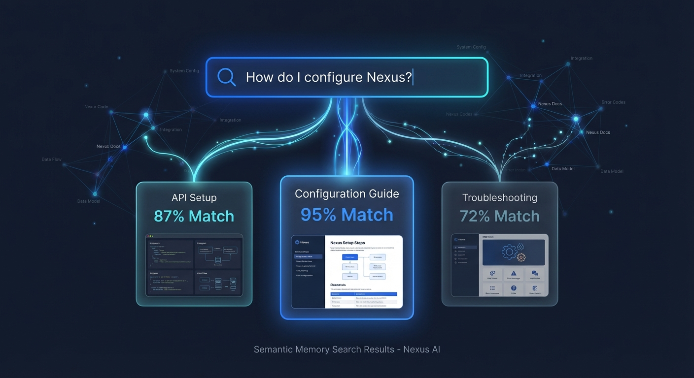

# Embeddings Guide

Embeddings are what let Nexus move from “search for matching words” to “retrieve the most relevant memory even when the wording changed.”

The system supports both local and remote embedding backends, and generation and embeddings can be configured independently.

## Why Embeddings Matter Here

Nexus uses embeddings in the semantic side of the working representation. That means embeddings help the system find candidate memories before the higher-level recall and query layers blend them with digests, recent explicit observations, derived insights, and contradictions.

In other words: embeddings are important, but they are part of a larger cognition stack rather than the whole story.



## Supported Embedding Modes

### Remote OpenAI-compatible providers

You can use provider-backed embeddings through OpenAI-compatible `/embeddings` APIs.

This works well for:

- OpenAI-compatible hosted providers
- Gemini’s OpenAI-compatible embedding surface
- OpenRouter-style compatible gateways
- local OpenAI-compatible servers

### Local ONNX

You can keep embeddings local with an ONNX model and tokenizer path.

### Local OpenAI-compatible runtimes

Nexus can also talk to local runtimes that expose an OpenAI-compatible interface, including:

- `vLLM`
- `LM Studio`
- `llama.cpp`

## Configuration Model

Embeddings are configured separately from the main generation model.

That means you can choose:

- the same provider and same model
- the same provider with a different embedding model
- a different provider entirely
- a local backend even when generation is remote

Common combinations:

- Gemini generation + Gemini embedding model
- Gemini generation + different Gemini embedding model
- Groq generation + Gemini embeddings
- OpenRouter generation + local ONNX embeddings
- local `vLLM` generation + local `LM Studio` embeddings

## Recommended Setup Flow

Use the interactive config flow:

```bash
nexus config
```

Then inspect the result:

```bash
nexus config show
```

You should see the active embedding mode clearly, including:

- whether embeddings are enabled
- backend
- provider
- model
- API key env
- base URL when relevant

For remote backends, Nexus no longer presents local ONNX paths as if they were active.

## Operational Advice

- If you want semantic recall, keep embeddings enabled.
- If you want the lightest possible setup, disable embeddings and let Nexus fall back to bounded text retrieval.
- If your generation provider does not offer a suitable embedding model, point embeddings at a different provider or a local backend.
- If a remote model is rate-limited, generation and embeddings can be switched independently.

## Validation

Recommended checks:

```bash
nexus config show
cargo test -p nexus-memory-embeddings
cargo test -p nexus-memory-agent
```

## Related Crates

- `nexus-embeddings`
- `nexus-vectors`
- `nexus-agent`
- `nexus-storage`
